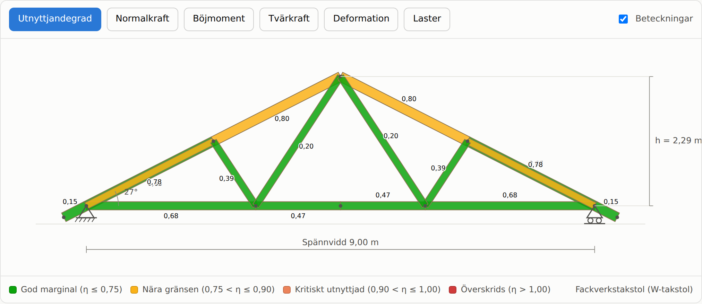

# Takstolsberäkning

Webbapplikation för dimensionering och beräkning av takstolar enligt Eurokod med
svenska nationella val. Verktyget beräknar snölast, laster och lastkombinationer,
löser takstolen som ett plant ram- och fackverkssystem och kontrollerar varje
stång enligt Eurokod 5. Allt körs i webbläsaren – ingen server behövs.



## Vad verktyget gör

- **Sex konstruktionsmodeller** – fackverkstakstol (W), ramverkstakstol med
  hanbjälke, samverkanstakstol med stödben, saxtakstol, parallelltakstol och
  pulpettakstol. Modellerna skiljer sig i verkningssätt: fackverken har ledade
  diagonaler medan ramverken har momentstyva knutpunkter, och
  samverkanstakstolen kombinerar båda.
- **Konfigurerbar geometri** – spännvidd, taklutning per takfall, taksprång,
  antal fack, hanbjälkens och stödbenens höjd, underramens lutning,
  konstruktionshöjd och takstolsavstånd.
- **Skiss** som ritas om direkt när indata ändras, med virket i verklig
  tvärsnittshöjd, måttsättning, upplagssymboler och vylägen för utnyttjandegrad,
  normalkraft, böjmoment, tvärkraft, deformation och laster.
- **Invändiga fria mått** som kan tändas och släckas i skissen: rumsbredd mellan
  stödben, fri höjd under hanbjälken, knäväggshöjd, fri höjd i nock och bredden
  där ståhöjd uppnås. Måtten är ljusa mått mellan virkets ytor – halva
  tvärsnittshöjden dras bort på varje begränsande stång – och redovisas även som
  tabell under fliken Resultat.
- **Snölast** enligt SS-EN 1991-1-3 med snözon, formfaktor, exponeringsfaktor och
  de tre lastfallen för sadeltak, inklusive de osymmetriska.
- **Virkeskvalitet** – C14–C35 enligt SS-EN 338 och GL28c–GL30h enligt
  SS-EN 14080, med standarddimensioner för svensk marknad.
- **Automatisk dimensionering** som söker minsta standarddimension per stångtyp,
  och en **kombinationsmatris** som visar hur virkeskvalitet och snözon
  tillsammans styr dimensionerna.
- **Beräkningsrapport** med materialdata, dimensionerande hållfastheter,
  kontroller i det avgörande snittet och redovisade förutsättningar.

## Beräkningsgång

1. **Laster** ställs upp per baslastfall: egentyngd (taktäckning, innertak och
   virkets egentyngd), tre snölastfall, nyttig last och eventuell vindlast.
2. **Lastkombinationer** genereras enligt SS-EN 1990 ekvation 6.10a och 6.10b med
   säkerhetsklassfaktorn γd och ψ-faktorer som beror på snözonen.
3. **Stomanalys** görs med direkta styvhetsmetoden. Varje stång är ett
   balkelement med tre frihetsgrader per nod, och diagonaler modelleras med
   momentled i båda ändar. Över- och underram är kontinuerliga över
   knutpunkterna.
4. **Superposition** – varje baslastfall löses en gång och kombineras linjärt,
   vilket gör att alla kombinationer kan kontrolleras i 21 snitt per stång.
5. **Kontroller** enligt SS-EN 1995-1-1: drag och böjning (6.17), tryck och
   böjning (6.19), knäckning (6.23/6.24), vippning (6.35), skjuvning (6.13) med
   sprickfaktor kcr samt tryck vinkelrätt fibrerna vid upplaget (6.3).
6. **Nedböjning** beräknas i bruksgränstillstånd, med slutvärde inklusive
   krypning enligt avsnitt 2.2.3.

## Regelverk

Beräkningen bygger på SS-EN 1990, SS-EN 1991-1-1, SS-EN 1991-1-3, SS-EN 1991-1-4
och SS-EN 1995-1-1 med svenska nationella val. Sedan 1 juli 2025 gäller Boverkets
föreskrifter BFS 2024:6 om bärförmåga, stadga och beständighet, som ersätter EKS
(BFS 2011:10 med ändringar). Övergångsbestämmelserna löpte ut 30 juni 2026.

Normvärden som kan ändras när föreskrifterna revideras ligger samlade och
kommenterade i `src/domain/loads.ts` (snözoner, ψ-faktorer, γd) och
`src/domain/materials.ts` (hållfasthetsklasser, kmod, kdef, γM), så att de går
att uppdatera på ett ställe.

Snözonen i appen är vägledande. Det bindande värdet läses ur lastkartan i
Boverkets konstruktionsregler för den aktuella platsen.

## Begränsningar

Verktyget är avsett för **preliminär dimensionering och överslag**. Följande
ingår inte och måste hanteras separat:

- Förbandens bärförmåga – spikplåtar, spikning och beslag dimensioneras enligt
  SS-EN 1995-1-1 kapitel 8. Knutpunkternas eftergivlighet ingår inte i
  stomanalysen.
- Stabilisering i byggnadens längdriktning: vindkryss, längsgående stagning och
  takskiva.
- Snöfickor och drivbildning mot högre byggnadsdelar, takkupor och
  takutrustning enligt SS-EN 1991-1-3 avsnitt 5.3.6 och kapitel 6.
- Vindlastens randzoner. Den förenklade vindlasten avser takets inre zoner och
  används för lyftkontroll av takstolen som helhet.
- Brandteknisk dimensionering och fuktdimensionering.

Handlingar för bygglov och byggskede ska granskas och signeras av en behörig
konstruktör. Fabrikstillverkade takstolar ska vara CE-märkta enligt SS-EN 14250.

## Komma igång

```bash
npm install
npm run dev        # utvecklingsserver
npm test           # enhetstester
npm run build      # produktionsbygge till dist/
```

Applikationen har inga externa beroenden utöver React och byggs som statiska
filer, så `dist/` kan läggas på vilken webbserver som helst.

## Publicering

Bygget är helt statiskt och behöver ingen server. `vite.config.ts` använder
`base: './'`, vilket gör att sidan fungerar både i en underkatalog (till exempel
en GitHub Pages-projektsida) och direkt från filsystemet.

### GitHub Pages

`.github/workflows/deploy-pages.yml` bygger, kör testerna och publicerar vid
varje push till `master`. Aktivera först Pages i repot:

**Settings → Pages → Build and deployment → Source: GitHub Actions**

Observera att GitHub Pages från ett **privat** repo kräver GitHub Team eller
Enterprise Cloud. Själva webbplatsen blir dessutom publik om inte
åtkomstkontroll för Pages används, vilket bara finns i Enterprise Cloud – koden
förblir privat, men sidan går att nå för den som har adressen.

### Andra alternativ

| Alternativ | Passar när |
|---|---|
| Cloudflare Pages | Verktyget ska vara internt. Gratis för privata repon, och Cloudflare Access ger inloggning framför sidan utan extra kostnad för mindre team. |
| Netlify | Enkel koppling till repot. Lösenordsskydd av hela sidan kräver betalplan. |
| Vercel | Enkel koppling till repot. Kommersiell användning kräver betalplan. |
| Egen webbserver eller intranät | Kopiera innehållet i `dist/` till valfri katalog som webbservern serverar. Inga krav på Node på servern. |
| Lokalt | Öppna `dist/index.html` direkt i webbläsaren, eller distribuera katalogen som en zip-fil. |

### Kontinuerlig integration

`.github/workflows/ci.yml` kör enhetstester, typkontroll och produktionsbygge på
varje push och pull request, oberoende av var applikationen publiceras.

## Kod

| Modul | Ansvar |
|---|---|
| `src/domain/materials.ts` | Hållfasthetsklasser, kmod, kdef, γM, standarddimensioner |
| `src/domain/loads.ts` | Snözoner, formfaktorer, egentyngder, lastkombinationer |
| `src/domain/vind.ts` | Hastighetstryck och formfaktorer för vindlast |
| `src/domain/fem.ts` | 2D ram- och fackverkslösare med momentled |
| `src/domain/geometri.ts` | Geometrigeneratorer för de sex takstolstyperna |
| `src/domain/ec5.ts` | Bärförmågekontroller enligt Eurokod 5 |
| `src/domain/analys.ts` | Lastuppställning, superposition, autodimensionering |
| `src/components/` | Gränssnitt: skiss, inmatning, resultat, matris, rapport |

FEM-lösaren är verifierad mot analytiska fall: fritt upplagd balk, inspänd balk,
konsolbalk och ett symmetriskt fackverk. Se `src/domain/fem.test.ts`.

## Bidra

Se [CONTRIBUTING.md](CONTRIBUTING.md) för branchstrategi och arbetssätt.
